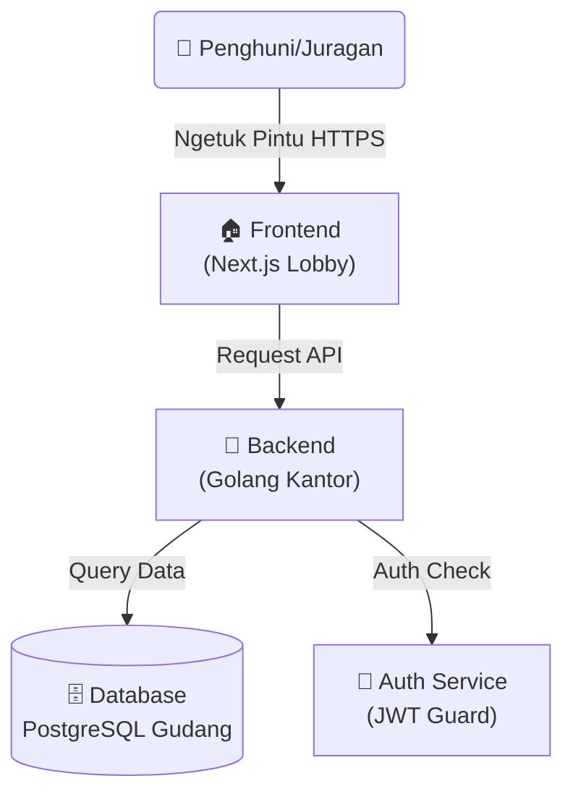

# 🏡 Aplikasi Kos-Kosan Perum Alam Sigura Gura

> _Sistem Manajemen Kos Paling Mantap, Aman, dan Terpercaya!_


Selamat datang di repo **Kos-Kosan Perum Alam Sigura Gura**! 😎  
Bukan sekedar aplikasi, ini adalah **Ekosistem Digital** buat para pencari kos dan juragan kos masa kini.

---

## 🗺️ Denah Lokasi (Architecture)

Biar gak nyasar di dalem kodingan, nih liat dulu denahnya:



---

## 📁 Struktur Folder

### Root Directory

```
/
├── be/                 # Backend (Golang)
├── fe/                 # Frontend (Next.js)
├── docs/               # Project documentation
├── .github/            # GitHub workflows
├── compose.yaml        # Docker Compose configuration
└── README.md          # You are here!
```

### Frontend Structure (`/fe`)

```
fe/
├── app/
│   ├── components/
│   │   ├── ui/              # Reusable UI components (shadcn/ui)
│   │   │   ├── button.tsx
│   │   │   ├── card.tsx
│   │   │   ├── input.tsx
│   │   │   └── ... (48 components)
│   │   ├── shared/          # Shared components
│   │   │   ├── Login.tsx
│   │   │   └── ImageWithFallback.tsx
│   │   ├── admin/           # Admin-specific features
│   │   │   ├── AdminDashboard.tsx
│   │   │   ├── RoomManagement.tsx
│   │   │   ├── TenantData.tsx
│   │   │   └── FinancialReports.tsx
│   │   └── tenant/          # Tenant-specific features
│   │       ├── homepage.tsx
│   │       ├── RoomDetail.tsx
│   │       ├── booking-flow.tsx
│   │       └── booking-history.tsx
│   ├── context/             # React Context (Global State)
│   │   ├── AppContext.tsx   # Main context provider
│   │   ├── types.ts         # TypeScript types
│   │   ├── useApp.ts        # Custom hook
│   │   └── index.ts         # Exports
│   ├── services/            # API services
│   │   └── api.ts          # Backend API client
│   ├── styles/              # Global styles
│   ├── admin/               # Admin routes
│   ├── api/                 # API routes
│   ├── layout.tsx           # Root layout
│   └── page.tsx             # Home page
├── docs/                    # Frontend documentation
│   ├── ARCHITECTURE.md
│   ├── STATE_MANAGEMENT_GUIDE.md
│   └── STATE_MANAGEMENT_SUMMARY.md
├── public/                  # Static assets
│   ├── favicon.ico
│   └── images/
└── [config files]           # Next.js, TypeScript, Tailwind configs
```

### Backend Structure (`/be`)

```
be/
├── cmd/
│   └── server/              # Application entry point
│       └── main.go
├── internal/
│   ├── config/              # Configuration management
│   ├── database/            # Database connection & migrations
│   ├── handlers/            # HTTP handlers (controllers)
│   │   ├── kamar.go
│   │   ├── review.go
│   │   ├── user.go
│   │   └── booking.go
│   ├── middleware/          # HTTP middleware
│   ├── models/              # Data models (structs)
│   ├── repository/          # Data access layer
│   │   ├── kamar.go
│   │   ├── review.go
│   │   └── ...
│   ├── service/             # Business logic
│   │   ├── kamar.go
│   │   ├── review.go
│   │   └── ...
│   └── utils/               # Utility functions
├── docs/                    # API documentation (Swagger)
├── Dockerfile
├── Makefile
├── go.mod
└── go.sum
```

---

## 🌟 Fasilitas Unggulan (Features)

Apa aja sih yang bikin kosan ini beda dari yang lain?

| Fitur                     | Deskripsi                                                     | Status |
| :------------------------ | :------------------------------------------------------------ | :----: |
| 🛏️ **Manajemen Kamar**    | Tambah, edit, hapus data kamar seenak jidat (kalo admin).     |   ✅   |
| 🧑‍🤝‍🧑 **Manajemen Penghuni** | Catat siapa aja yang nunggak bayar.                           |   ✅   |
| 🔐 **Sistem Keamanan**    | Login pake JWT, password di-hash pake BCrypt. Maling nangis!  |   ✅   |
| 🐳 **Docker Ready**       | Sekali klik `docker compose up`, langsung jadi komplek kosan. |   ✅   |
| 🧹 **Code Bersih**        | Udah dipasangi `linter` biar gak ada sampah kode berserakan.  |   ✅   |
| 📝 **Dokumentasi API**    | Ada Swagger-nya bos, gak perlu nebak-nebak endpoint.          |   ✅   |
| 📱 **Responsive Design**  | Tampilan kece di HP, tablet, sampe layar monitor jumbo.       |   ✅   |
| 🌙 **Dark Mode**          | Biar mata gak sakit kalo coding malam-malam.                  |   ✅   |
| 🎨 **Modern UI**          | Pakai shadcn/ui + Tailwind CSS, desainnya kelas dunia!        |   ✅   |

---

## 🚀 Cara Mulai Ngekos (Getting Started)

### 📋 Syarat Masuk

Sebelum masuk, pastikan komputer lo udah punya:

- **Docker** (Wajib banget buat kaum mager)
- **Go 1.23+** (Kalo mau jadi tukang bangunan backend)
- **Node.js 18+** (Kalo mau ngecat tembok frontend)
- **Make** (Biar hidup lebih mudah)

### 📦 Jalur VIP (Pake Docker)

Cara paling cepet, gak pake ribet, tinggal duduk manis.

1. **Clone Repo** (Copy kuncinya):

   ```bash
   git clone https://github.com/allfaris13/platfrom-kos.git
   cd platfrom-kos
   ```

2. **Bangun Komplek**:

   ```bash
   docker compose up --build
   ```

   _Tunggu bentar, lagi ngaduk semen..._ 🏗️

3. **Jadi Deh!**:
   - 🏠 **Frontend**: [http://localhost:3000](http://localhost:3000)
   - 🏢 **Backend**: [http://localhost:8080](http://localhost:8080)
   - 📖 **API Docs**: [http://localhost:8080/docs/index.html](http://localhost:8080/docs/index.html) (Cek Swagger)

---

## 🛠️ Jalur Tukang (Development)

Buat lo yang suka ngoprek daleman kosan.

### 🏃‍♂️ Backend (Ruang Mesin)

```bash
cd be
make run       # Nyalain mesin
make test      # Cek mesin ada yang bunyi aneh gak
make lint      # Bersihin oli yang berceceran
```

**API Endpoints** (contoh):

- `GET /api/kamar` - Ambil semua kamar
- `GET /api/kamar/:id` - Detail kamar
- `POST /api/reviews` - Tulis review
- `GET /api/reviews/:kamar_id` - Lihat review

### 🎨 Frontend (Dekorasi)

```bash
cd fe
npm install    # Belanja bahan bangunan
npm run dev    # Mulai ngecat
```

**Component Structure**:

- `/app/components/ui` - Komponen dasar (button, card, input, dll)
- `/app/components/shared` - Komponen bersama (Login, ImageWithFallback)
- `/app/components/admin` - Fitur khusus admin
- `/app/components/tenant` - Fitur khusus penyewa

**State Management**:
Aplikasi ini pakai React Context API. Baca panduan lengkapnya di:

- [State Management Guide](fe/docs/STATE_MANAGEMENT_GUIDE.md)
- [Architecture Overview](fe/docs/ARCHITECTURE.md)

---

## 🎨 Design System

### Color Palette

- **Main Color**: Stone (stone-700, stone-800, stone-900)
- **Side Color**: Slate (backgrounds, accents)
- **Accent**: Amber (ratings, highlights)
- **Status**:
  - Success: Emerald
  - Warning: Amber
  - Error: Red

### Dark Mode

Semua komponen support dark mode. Toggle di navbar untuk nyobain! 🌙

---

## 🚑 Masalah Umum (Troubleshooting)

**Q: Kok port 8080/3000 udah kepake?**  
A: Pastiin gak ada aplikasi lain yang lagi jalan. Kalo "kosan sebelah" lagi dangdutan di port yang sama, ya bentrok. `kill` dulu prosesnya.

**Q: Database gak mau konek?**  
A: Cek `.env` lo, udah bener belum passwordnya? Atau jangan-jangan container database-nya belum bangun (masih bobok). Coba `docker compose restart db`.

**Q: Import error di frontend?**  
A: Pastiin path-nya bener. Sekarang struktur foldernya udah dirapiin:

- ✅ `'@/app/components/shared/Login'`
- ❌ `'@/app/components/Login'` (old path)

**Q: Dark mode gak jalan?**  
A: Toggle ada di navbar. Preference disimpan di localStorage, bisa di-clear kalo bermasalah.

---

## 📚 Dokumentasi Tambahan

### Frontend

- [Architecture](fe/docs/ARCHITECTURE.md) - Struktur arsitektur frontend
- [State Management Guide](fe/docs/STATE_MANAGEMENT_GUIDE.md) - Cara pakai global state
- [State Management Summary](fe/docs/STATE_MANAGEMENT_SUMMARY.md) - Quick reference

### Backend

- API Documentation ada di Swagger: `http://localhost:8080/docs/index.html`
- Database schema ada di `be/internal/database/`

---

## 🤝 Bantu Renovasi (Contributing)

Mau nambahin kolam renang? Atau benerin genteng bocor? Gas!

1. Fork repo ini.
2. Bikin branch baru (`git checkout -b fitur-kolam-renang`).
3. Commit perubahan (`git commit -m "Nambahin kolam renang biar seger"`).
4. Push ke branch (`git push origin fitur-kolam-renang`).
5. Bikin Pull Request, nanti Pak Juragan (Maintainer) yang review.

### Contribution Guidelines

- Follow existing folder structure
- Use TypeScript (frontend) & Go best practices (backend)
- Write clean, documented code
- Test your changes before PR
- Update documentation if needed

---

## 🛣️ Roadmap

- [ ] Payment gateway integration
- [ ] Email notifications
- [ ] Chat/messaging system
- [ ] Mobile app (React Native)
- [ ] Advanced analytics dashboard
- [ ] Multi-language support

---

## 📄 License

MIT License - Silakan pakai sepuasnya, tapi kasih credit ya! 😊

---

> _Dibuat dengan ❤️ dan secangkir ☕ di Malang._
