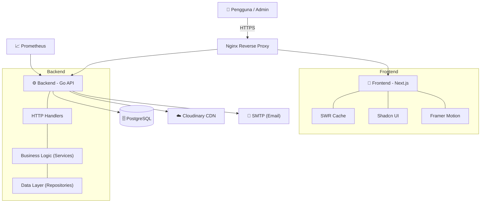

<div align="center">
  <h1>🏡 Platform Kos</h1>
  <p>
    <strong>Sistem Manajemen Kos Tingkat Lanjut — Full-Stack, Aman, dan Siap Produksi 🚀</strong>
  </p>
  <p>
    <a href="https://golang.org"></a>
    <a href="https://nextjs.org"></a>
    <a href="https://www.postgresql.org"></a>
    <a href="https://tailwindcss.com"></a>
    <a href="https://docker.com"></a>
    <a href="https://prometheus.io/"></a>
  </p>
</div>

---

**Platform Kos** adalah aplikasi manajemen kos-kosan *full-stack* tingkat enterprise yang memadukan keandalan backend **Go (Gin + GORM)** bermetode *Clean Architecture* dengan antarmuka **Next.js (App Router)** yang modern dan interaktif. Proyek ini dirancang khusus untuk pengelola kos yang ingin mendigitalkan seluruh operasionalnya secara efisien, aman, dan terskala.

## ✨ Fitur Utama

### 🔐 Security & Authentication (Pengamanan Kelas Enterprise)
- **HttpOnly Cookie JWT** — Token dienkripsi penuh dan tidak bisa diakses XSS via JavaScript.
- **Refresh Token Rotation** — Rotasi token rahasia berjalan di *background* untuk sesi seamless.
- **Google OAuth 2.0** — Sistem login modern, cepat, dan aman via akun Google.
- **Role-Based Access Control (RBAC)** — Pemisahan rute ketat antara Admin dan Penyewa.
- **Endpoint Protection** — Rate Limiting anti brute-force dan IDOR *Protection* di semua data sensitif.

### 🏠 Room & Property Management
- Manajemen kamar *(CRUD)* dinamis didukung **Multi-Image Upload** via Cloudinary CDN.
- Status kamar terautomasi: `Tersedia` → `Booked` → `Terisi` → `Perbaikan`.
- Pendataan lengkap: Tipe kamar, fasilitas (AC/Non-AC, Kamar Mandi Dalam), harga, dan lantai.

### 📋 Smart Booking System
- Alur *booking* dengan optimasi **Atomic Database Transactions** (Anti bentrok pesanan).
- Autokalkulasi tagihan dan kadaluarsa otomatis via *Background Worker* (`cron`).
- Pembaruan status reservasi dari dashboard. Fitur perpanjang sewa yang cepat (1-klik).

### 💳 Payment & Finance Management
- Opsi pembayaran fleksibel: **Transfer Bank** (Upload Bukti) atau **Cash** (Pencatatan Admin).
- Skema pelunasan **Full Payment** atau cicilan **Down Payment (DP)**.
- **Automated Room Status Updates**: Status kamar berubah otomatis (*real-time*) pasca konfirmasi pembayaran (Midtrans/Manual).
- Pencatatan Pemasukan (*Income*) dan Pengeluaran (*Expense*) terintegrasi di Dashboard.

### 📊 Admin Analytics Dashboard
- **Revenue Analytics** & Tren Keuangan interaktif menggunakan visualisasi *Recharts*.
- Statistik okupansi yang *real-time* dan akurat.
- Pemantauan *health-check* sistem menggunakan **Prometheus**.

### 🎨 User Experience (UX) & UI Modern
- Skema warna **Glassmorphism + Premium Dark Mode**.
- Animasi presisi menggunakan **Framer Motion** & Loading Screens dinamis di setiap halaman.
- Performa secepat kilat (Instant Loading) berkat arsitektur swr-caching **(SWR)**.

---

## 🏗️ Arsitektur Sistem

Sistem direkayasa untuk berskala besar (Scalable) dan mudah di-maintain.


```mermaid
graph TD
    A["👤 Pengguna / Admin"] -->|HTTPS| B["Nginx Reverse Proxy"]
    B --> C["🎨 Frontend - Next.js"]
    B --> D["⚙️ Backend - Go API"]
    D --> E[("🗄️ PostgreSQL")]
    D --> F["☁️ Cloudinary CDN"]
    D --> G["📧 SMTP (Email)"]
    H["📈 Prometheus"] --> D

    subgraph Frontend
        C --- SWR["SWR Cache"]
        C --- Shadcn["Shadcn UI"]
        C --- Motion["Framer Motion"]
    end

    subgraph Backend
        D --- Handlers["HTTP Handlers"]
        Handlers --- Services["Business Logic (Services)"]
        Services --- Repos["Data Layer (Repositories)"]
    end
```

---

## 📁 Struktur Proyek (Monorepo)

```text
platfrom-kos/
├── be/                          # Backend (Go)
│   ├── cmd/api/main.go          # Entry point aplikasi
│   ├── internal/                # Clean Architecture core modules
│   │   ├── handlers/            # HTTP Routing & Controller
│   │   ├── service/             # Business Logic Layer
│   │   ├── repository/          # Database Query & Transactions
│   │   └── models/              # GORM Entities
│   └── docs/                    # Swagger OpenAPI Documentation
│
├── fe/                          # Frontend (Next.js 16)
│   ├── app/                     # App Router pages (Admin & Tenant)
│   ├── components/              # Shadcn, Framer Motion, Shared UI
│   ├── services/                # API client layer (Fetch/SWR)
│   └── middleware.ts            # Route protection
│
├── docs/                        # 📚 Technical Documentation (GitBook)
├── nginx/                       # Nginx Configuration
└── docker-compose.yml           # Infrastruktur Production
```

---

## 🚀 Quick Start / Cara Menjalankan

### Prasyarat

- **Go** >= 1.24
- **Node.js** >= 18
- **PostgreSQL** >= 15
- **Docker & Docker Compose** (Disarankan)

### Opsi 1: Docker (Paling Cepat)

```bash
# 1. Clone repository
git clone https://github.com/PENGGUNA/platfrom-kos.git
cd platfrom-kos

# 2. Jalankan seluruh stack
docker compose up --build -d

# Akses langsung:
# 🌐 Frontend: http://localhost
# ⚙️ Backend API: http://localhost:8080
```

### Opsi 2: Local Development

```bash
# 1. Setup Database
createdb koskosan_db

# 2. Jalankan Backend (Go)
cd be
cp .env.example .env      # Wajib disesuaikan
go mod tidy
go run cmd/api/main.go     # Berjalan di port 8081

# 3. Jalankan Frontend (Next.js) pada terminal baru
cd fe
cp .env.example .env.local # Wajib disesuaikan
npm install
npm run dev                # Berjalan di port 3000
```
> 📖 **Panduan Instalasi Lengkap** tersedia di [`docs/getting-started/project-setup.md`](docs/getting-started/project-setup.md).

---

## 🗺️ Roadmap & Pencapaian

- [x] 🏠 Manejemen Kamar Komprehensif (Multi-Image)
- [x] 📋 Sistem Booking Presisi dengan Atomic Transactions
- [x] 💳 Pilihan Pembayaran Fleksibel (Transfer, Cash, Midtrans Readiness)
- [x] 🔐 Enterprise-grade Security (HttpOnly JWT, OAuth, RBAC)
- [x] 📊 Dashboard Analitik Cerdas untuk Pemasukan dan Okupansi
- [x] � UX/UI Refinements (Loading Screens, Typography Fixes)
- [x] 📚 Dokumentasi Teknis via GitBook terintegrasi
- [ ] 💬 In-App Chat System / Notifikasi Real-time
- [ ] 📱 Mobile Companion App (React Native / Expo)
- [ ] 🤖 AI-Powered Pricing Recommendations (Dynamic Pricing)
- [ ] 🌐 Dukungan Multi-Properti untuk Skala Besar

---

## 📚 Dokumentasi Lebih Lanjut

Dokumentasi Platform Kos diarsip secara rapi di dalam folder `docs/` dengan standarisasi [GitBook](https://gitbook.com/):

- 🌟 **[Getting Started](docs/getting-started/README.md)**: Arsitektur, Tech Stack, & Setup Proyek
- 🏛️ **[Architecture](docs/architecture/README.md)**: Clean Architecture Breakdown & ERD
- 🛡️ **[Security](docs/security/README.md)**: Praktik Kriptografi dan Pengamanan API
- 🛠️ **[Features](docs/features/README.md)**: Referensi 30+ endpoint & Implementasi UI
- 🚀 **[DevOps](docs/devops/README.md)**: Panduan Deployment Server & CI/CD

---

<p align="center">
  <sub>Didistribusikan di bawah <strong>Lisensi MIT</strong>. Lihat <a href="LICENSE">LICENSE</a> untuk detail spesifik.</sub><br>
  <sub>Built with ❤️ — <strong>Platform Kos</strong>, The Modern Boarding House Solution.</sub>
</p>
