# 🏡 Aplikasi Kos-Kosan Perum Alam Sigura Gura

> _Sistem Manajemen Kos Paling Mantap, Aman, dan Terpercaya!_


Selamat datang di repo **Kos-Kosan Perum Alam Sigura Gura**! 😎
Bukan sekedar aplikasi, ini adalah **Ekosistem Digital** buat para pencari kos dan juragan kos masa kini.

---

## 🗺️ Denah Lokasi (Architecture)

Biar gak nyasar di dalem kodingan, nih liat dulu denahnya:

```mermaid
graph TD
    User("👱 Penghuni/Juragan") -->|Ngetuk Pintu HTTPS| FE["🏠 Frontend<br>(Next.js Lobby)"]
    FE -->|Request API| BE["🏢 Backend<br>(Golang Kantor)"]
    BE -->|Query Data| DB[("🗄️ Database<br>PostgreSQL Gudang")]
    BE -->|Auth Check| Satpam["👮 Auth Service<br>(JWT Guard)"]
```



---

## 🌟 Fasilitas Unggulan (Features)

Apa aja sih yang bikin kosan ini beda dari yang lain?

| Fitur                     | Deskripsi                                                     | Status |
| :------------------------ | :------------------------------------------------------------ | :----: |
| 🛏️ **Manajemen Kamar**    | Tambah, edit, hapus data kamar seenak jidat (kalo admin).     |   ✅   |
| 🧑‍🤝‍🧑 **Manajemen Penghuni** | Catat siapa aja yang nunggak bayar.                           |   ✅   |
| 🔐 **Sistem Keamanan**    | Login pake JWT, password di-hash pake BCrypt. Maling nangis!  |   ✅   |
| 🐳 **Docker Ready**       | Sekali klik `docker compose up`, langsung jadi komplek kosan. |   ✅   |
| 🧹 **Code Bersih**        | Udah dipasangi `linter` biar gak ada sampah kode berserakan.  |   ✅   |
| 📝 **Dokumentasi API**    | Ada Swagger-nya bos, gak perlu nebak-nebak endpoint.          |   ✅   |

---

## 🚀 Cara Mulai Ngekos (Getting Started)

### 📋 Syarat Masuk

Sebelum masuk, pastikan komputer lo udah punya:

- **Docker** (Wajib banget buat kaum mager)
- **Go 1.23+** (Kalo mau jadi tukang bangunan backend)
- **Node.js 18+** (Kalo mau ngecat tembok frontend)
- **Make** (Biar hidup lebih mudah)

### 📦 Jalur VIP (Pake Docker)

Cara paling cepet, gak pake ribet, tinggal duduk manis.

1. **Clone Repo** (Copy kuncinya):

   ```bash
   git clone https://github.com/allfaris13/platfrom-kos.git
   cd platfrom-kos
   ```

2. **Bangun Komplek**:

   ```bash
   docker compose up --build
   ```

   _Tunggu bentar, lagi ngaduk semen..._ 🏗️

3. **Jadi Deh!**:
   - 🏠 **Frontend**: [http://localhost:3000](http://localhost:3000)
   - 🏢 **Backend**: [http://localhost:8080](http://localhost:8080)
   - 📖 **API Docs**: [http://localhost:8080/docs/index.html](http://localhost:8080/docs/index.html) (Cek Swagger)

---

## 🛠️ Jalur Tukang (Development)

Buat lo yang suka ngoprek daleman kosan.

### 🏃‍♂️ Backend (Ruang Mesin)

```bash
cd be
make run       # Nyalain mesin
make test      # Cek mesin ada yang bunyi aneh gak
make lint      # Bersihin oli yang berceceran
```

### 🎨 Frontend (Dekorasi)

```bash
cd fe
npm install    # Belanja bahan bangunan
npm run dev    # Mulai ngecat
```

---

## 🚑 Masalah Umum (Troubleshooting)

**Q: Kok port 8080/3000 udah kepake?**
A: Pastiin gak ada aplikasi lain yang lagi jalan. Kalo "kosan sebelah" lagi dangdutan di port yang sama, ya bentrok. `kill` dulu prosesnya.

**Q: Database gak mau konek?**
A: Cek `.env` lo, udah bener belum passwordnya? Atau jangan-jangan container database-nya belum bangun (masih bobok). Coba `docker compose restart db`.

---

## 🤝 Bantu Renovasi (Contributing)

Mau nambahin kolam renang? Atau benerin genteng bocor? Gas!

1. Fork repo ini.
2. Bikin branch baru (`git checkout -b fitur-kolam-renang`).
3. Commit perubahan (`git commit -m "Nambahin kolam renang biar seger"`).
4. Push ke branch (`git push origin fitur-kolam-renang`).
5. Bikin Pull Request, nanti Pak Juragan (Maintainer) yang review.

---

> _Dibuat dengan sedikit ☕ di Malang._
