# 🏡 Kost Putra Rahmat ZAW - Management System

> _Sistem Manajemen Kos Putra Paling Modern, Kencang, dan Aman di Malang!_

[](https://golang.org)
[](https://nextjs.org)
[](https://sqlite.org)
[](https://swr.vercel.app)
[](https://docker.com)
[](https://tailwindcss.com)

Selamat datang di repo **Kost Putra Rahmat ZAW**! 😎 
Bukan sekedar aplikasi, ini adalah platform premium buat penghuni dan pengelola kos yang mengutamakan kecepatan (SWR), keamanan (Security Hardened), dan kenyamanan UI (shadcn/ui).

---

## 🗺️ Denah Lokasi (Architecture)

Aplikasi ini menggunakan arsitektur modern yang memisahkan antara frontend dan backend (Decoupled Architecture).

```mermaid
graph TD
    User("👱 Penghuni/Admin") -->|HTTPS| FE["🏠 Frontend Lobby<br>(Next.js + SWR Cache)"]
    FE -->|API Request| BE["🏢 Backend Kantor<br>(Golang API)"]
    BE -->|Query| DB[("🗄️ Database<br>Gudang SQLite")]
    BE -->|Auth| Satpam["👮 Auth Guard<br>(JWT + Argon2)"]

    subgraph "Frontend Engine"
    FE --- SWR[SWR Data Sync]
    FE --- Framer[Framer Motion Animations]
    end

    subgraph "Backend Engine"
    BE --- Gin[Gin Gonic Framework]
    BE --- Repo[Repository Pattern]
    end
```



---

## ✨ Fitur Unggulan (Premium Features)

### 🎨 Frontend (The User Experience)

- **⚡ Zero-Loading Navigation**: Berkat **SWR**, data di-cache otomatis. Pindah tab? Instan!
- **💎 Glassmorphism UI**: Tampilan modern dengan efek transparansi & blur yang premium menggunakan **Tailwind CSS**.
- **🎭 Smooth Animations**: Interaksi halus saat buka modal atau transisi halaman via **Framer Motion**.
- **📱 Ultra Responsive**: Nyaman dibuka dari HP Android, iPhone, sampai monitor gaming jumbo.
- **🌙 Theme Switcher**: Dukungan penuh Dark Mode & Light Mode yang elegan.

### ⚙️ Backend (The Powerhouse)

- **🏎️ High Performance**: Ditenagai **Go 1.24** dengan kompilasi super cepat.
- **🔐 Security First**: CORS policy ketat, password hashing yang aman, dan JWT authentication.
- **🏢 Clean Architecture**: Menggunakan pattern `Handler -> Service -> Repository` yang mudah dirawat.
- **📝 Live Documentation**: Dokumentasi API interaktif menggunakan **Swagger UI**.

---

## 📁 Struktur Bangunan (Folders)

```text
/
├── be/                 # 🏗️ Backend (Golang Engine)
│   ├── cmd/            # Entry point (main.go)
│   ├── internal/       # Core logic (Handlers, Services, Repos)
│   └── docs/           # API Docs (Swagger)
├── fe/                 # 🎨 Frontend (Next.js Application)
│   ├── app/            # Pages & Components
│   ├── context/        # Global State (Login, Theme)
│   └── docs/           # Technical Frontend Docs
├── compose.yaml        # 🐳 Blueprint Docker (One-click setup)
└── README.md           # 📍 Peta Utama
```

---

## 🚀 Cara Mulai (Getting Started)

### 📋 Prasyarat

- **Docker** & **Docker Compose**
- **Node.js 18+** (Hanya jika ingin mengembangkan FE terpisah)
- **Go 1.24+** (Hanya jika ingin mengembangkan BE terpisah)

### 📦 Jalur Cepat (Pake Docker)

1. **Clone Repo**:
   ```bash
   git clone https://github.com/allfaris13/platfrom-kos.git
   cd platfrom-kos
   ```
2. **Nyalakan Layanan**:
   ```bash
   docker compose up --build
   ```
3. **Nikmati Hasilnya**:
   - 🏠 **Lobby Utama**: [http://localhost:3000](http://localhost:3000)
   - 🏢 **Kantor BE**: [http://localhost:8080](http://localhost:8080)
   - 📖 **Swagger API Docs**: [http://localhost:8080/docs/index.html](http://localhost:8080/docs/index.html)

### 🛠️ Jalur Tukang (Development)

#### **Backend (`/be`)**

```bash
cd be
make run       # Gaspol server!
make test      # Cek kesehatan kode
make lint      # Sapu-sapu kode kotor
```

#### **Frontend (`/fe`)**

```bash
cd fe
npm install    # Unduh material UI
npm run dev    # Mulai dekorasi
```

---

## 🛣️ Rencana Renovasi (Roadmap)

- [ ] 💳 **Otomatisasi Pembayaran**: Integrasi Midtrans/Xendit.
- [ ] 💬 **In-App Messaging**: Chat langsung antara penyewa dan admin.
- [ ] 📅 **Kalender Pintar**: Notifikasi jatuh tempo sewa otomatis via WhatsApp.
- [ ] 📊 **Dashboard Juragan**: Laporan keuangan lengkap dalam hitungan detik.

---

## 📄 Lisensi

Distribusi di bawah **MIT License**. Silakan pakai dan modifikasi, tapi jangan lupa bawa martabak ke Malang ya! 😉

---

> _Dibuat di Malang. Kost Putra Rahmat ZAW - Home away from home._
