# System Architecture

## Overview

Aplikasi Kos-Kosan Perum Alam Sigura Gura adalah full-stack web application yang menggunakan arsitektur modern dengan pemisahan frontend dan backend.

## Technology Stack

### Frontend

- **Framework**: Next.js 15 (App Router)
- **Language**: TypeScript
- **UI Library**: React 18
- **Styling**: Tailwind CSS + shadcn/ui
- **State Management**: React Context API
- **Animations**: Framer Motion
- **HTTP Client**: Fetch API
- **Date Library**: date-fns

### Backend

- **Language**: Go 1.24
- **Web Framework**: Gin
- **Database**: PostgreSQL 15
- **ORM**: GORM
- **Authentication**: JWT
- **Password Hashing**: BCrypt
- **API Documentation**: Swagger/OpenAPI

### Infrastructure

- **Containerization**: Docker
- **Orchestration**: Docker Compose
- **Reverse Proxy**: (Future: Nginx/Caddy)
- **CI/CD**: GitHub Actions

## System Architecture Diagram

```mermaid
graph TB
    subgraph "Client Layer"
        Browser["🌐 Web Browser"]
        Mobile["📱 Mobile Browser"]
    end

    subgraph "Frontend Layer"
        NextJS["Next.js 15 App<br/>Port: 3000"]
        SSR["Server-Side Rendering"]
        NextJS --> SSR
    end

    subgraph "Backend Layer"
        API["Go/Gin API Server<br/>Port: 8080"]
        Auth["JWT Auth Middleware"]
        Handlers["HTTP Handlers"]
        Services["Business Logic"]
        Repositories["Data Access Layer"]

        API --> Auth
        Auth --> Handlers
        Handlers --> Services
        Services --> Repositories
    end

    subgraph "Data Layer"
        PostgreSQL["PostgreSQL Database<br/>Port: 5432"]
        LocalStorage["Browser LocalStorage"]
    end

    Browser --> NextJS
    Mobile --> NextJS
    NextJS -.REST API.-> API
    Repositories --> PostgreSQL
    NextJS --> LocalStorage

    style NextJS fill:#0070f3,stroke:#333,stroke-width:2px,color:#fff
    style API fill:#00ADD8,stroke:#333,stroke-width:2px,color:#fff
    style PostgreSQL fill:#336791,stroke:#333,stroke-width:2px,color:#fff
```



## Component Architecture

### Frontend Architecture


### Backend Architecture (Go)


## Data Flow

### User Booking Flow


### Admin Room Management Flow


## API Architecture

### RESTful Endpoints

| Method   | Endpoint                 | Description          | Auth Required |
| -------- | ------------------------ | -------------------- | ------------- |
| `GET`    | `/api/kamar`             | Get all rooms        | No            |
| `GET`    | `/api/kamar/:id`         | Get room by ID       | No            |
| `POST`   | `/api/kamar`             | Create new room      | Yes (Admin)   |
| `PUT`    | `/api/kamar/:id`         | Update room          | Yes (Admin)   |
| `DELETE` | `/api/kamar/:id`         | Delete room          | Yes (Admin)   |
| `GET`    | `/api/reviews/:kamar_id` | Get reviews for room | No            |
| `POST`   | `/api/reviews`           | Create review        | Yes           |
| `POST`   | `/api/auth/login`        | User login           | No            |
| `POST`   | `/api/auth/register`     | User registration    | No            |
| `GET`    | `/api/bookings`          | Get all bookings     | Yes (Admin)   |
| `POST`   | `/api/bookings`          | Create booking       | Yes           |

## Security Architecture

### Authentication Flow


### JWT Structure

```json
{
  "header": {
    "alg": "HS256",
    "typ": "JWT"
  },
  "payload": {
    "user_id": 123,
    "email": "user@example.com",
    "role": "tenant",
    "exp": 1234567890
  }
}
```

## Deployment Architecture

### Development Environment


### Production Environment (Future)


## Performance Considerations

### Frontend Optimization

- **Server-Side Rendering**: Next.js SSR for faster initial page load
- **Code Splitting**: Automatic code splitting per route
- **Image Optimization**: Custom ImageWithFallback component
- **Client-Side Caching**: LocalStorage for persistent state
- **Lazy Loading**: Dynamic imports for heavy components

### Backend Optimization

- **Connection Pooling**: Database connection pool
- **Caching Strategy**: (Future: Redis for API responses)
- **Indexing**: Database indexes on frequently queried fields
- **Pagination**: Limit result sets for large queries
- **Gzip Compression**: Response compression

## Scalability Strategy

### Horizontal Scaling

- Multiple frontend instances behind load balancer
- Multiple backend API instances
- Database read replicas for read-heavy operations

### Vertical Scaling

- Increase server resources (CPU, RAM)
- Optimize database queries
- Add caching layer

## Monitoring & Logging

### Logging Strategy

- **Frontend**: Console logs (development), Error tracking (production)
- **Backend**: Structured logging with log levels
- **Database**: Query logs for slow queries

### Metrics to Track

- API response times
- Database query performance
- Error rates
- User activity
- System resource usage

## Future Enhancements

- [ ] Real-time notifications (WebSocket)
- [ ] Payment gateway integration
- [ ] Email service for notifications
- [ ] Mobile application (React Native)
- [ ] Advanced analytics dashboard
- [ ] Multi-tenant support
- [ ] Internationalization (i18n)
- [ ] Progressive Web App (PWA)
