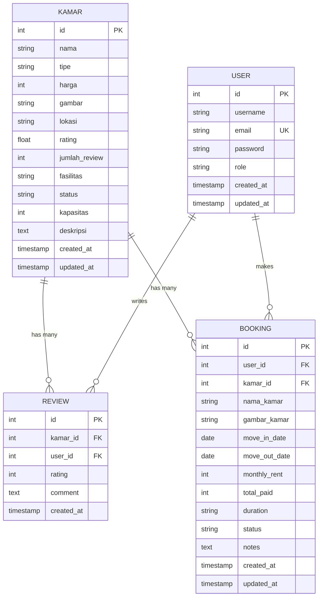

# Database Schema Documentation

## Overview

Database schema untuk aplikasi Kos-Kosan menggunakan PostgreSQL dengan GORM sebagai ORM.

**Database Name**: `tugas_arkan`  
**DBMS**: PostgreSQL 15  
**Port**: 5432  
**Encoding**: UTF8

## Entity Relationship Diagram



## Tables

### 1. KAMAR (Rooms)

Tabel untuk menyimpan data kamar kos.

| Column          | Type         | Constraints                 | Description                                              |
| --------------- | ------------ | --------------------------- | -------------------------------------------------------- |
| `id`            | INTEGER      | PRIMARY KEY, AUTO_INCREMENT | Unique room identifier                                   |
| `nama`          | VARCHAR(255) | NOT NULL                    | Room name                                                |
| `tipe`          | VARCHAR(50)  | NOT NULL                    | Room type (Standard, Deluxe, Premium, Executive)         |
| `harga`         | INTEGER      | NOT NULL                    | Monthly price in IDR                                     |
| `gambar`        | TEXT         |                             | Room image URL                                           |
| `lokasi`        | VARCHAR(255) |                             | Room location                                            |
| `rating`        | DECIMAL(3,2) | DEFAULT 0.0                 | Average rating (0-5)                                     |
| `jumlah_review` | INTEGER      | DEFAULT 0                   | Total number of reviews                                  |
| `fasilitas`     | TEXT         |                             | JSON array of facilities                                 |
| `status`        | VARCHAR(50)  | DEFAULT 'Available'         | Room status (Available, Occupied, Maintenance, Reserved) |
| `kapasitas`     | INTEGER      | DEFAULT 1                   | Max occupancy                                            |
| `deskripsi`     | TEXT         |                             | Room description                                         |
| `created_at`    | TIMESTAMP    | DEFAULT NOW()               | Record creation time                                     |
| `updated_at`    | TIMESTAMP    | DEFAULT NOW()               | Last update time                                         |

**Indexes**:

- `idx_kamar_status` on `status`
- `idx_kamar_tipe` on `tipe`
- `idx_kamar_harga` on `harga`

**Example Data**:

```sql
INSERT INTO kamar (nama, tipe, harga, lokasi, status, kapasitas, deskripsi) VALUES
('Deluxe Suite', 'Deluxe', 1200000, 'Downtown District', 'Available', 1, 'Spacious deluxe room'),
('Modern Studio', 'Standard', 800000, 'University Area', 'Available', 1, 'Modern comfort'),
('Premium Apartment', 'Premium', 1500000, 'Business District', 'Occupied', 2, 'Luxury living');
```

---

### 2. USER (Users)

Tabel untuk menyimpan data pengguna (tenant atau admin).

| Column       | Type         | Constraints                 | Description               |
| ------------ | ------------ | --------------------------- | ------------------------- |
| `id`         | INTEGER      | PRIMARY KEY, AUTO_INCREMENT | Unique user identifier    |
| `username`   | VARCHAR(100) | NOT NULL                    | Username                  |
| `email`      | VARCHAR(255) | UNIQUE, NOT NULL            | Email address             |
| `password`   | VARCHAR(255) | NOT NULL                    | BCrypt hashed password    |
| `role`       | VARCHAR(20)  | DEFAULT 'tenant'            | User role (tenant, admin) |
| `created_at` | TIMESTAMP    | DEFAULT NOW()               | Account creation time     |
| `updated_at` | TIMESTAMP    | DEFAULT NOW()               | Last update time          |

**Indexes**:

- `idx_user_email` on `email` (UNIQUE)
- `idx_user_role` on `role`

**Example Data**:

```sql
INSERT INTO user (username, email, password, role) VALUES
('admin', 'admin@koskosan.com', '$2a$10$...', 'admin'),
('john_doe', 'john@example.com', '$2a$10$...', 'tenant');
```

---

### 3. REVIEW (Reviews)

Tabel untuk menyimpan review dari pengguna terhadap kamar.

| Column       | Type      | Constraints                 | Description              |
| ------------ | --------- | --------------------------- | ------------------------ |
| `id`         | INTEGER   | PRIMARY KEY, AUTO_INCREMENT | Unique review identifier |
| `kamar_id`   | INTEGER   | FOREIGN KEY, NOT NULL       | References `kamar(id)`   |
| `user_id`    | INTEGER   | FOREIGN KEY, NOT NULL       | References `user(id)`    |
| `rating`     | INTEGER   | NOT NULL, CHECK (1-5)       | Rating score             |
| `comment`    | TEXT      |                             | Review comment           |
| `created_at` | TIMESTAMP | DEFAULT NOW()               | Review creation time     |

**Foreign Keys**:

- `fk_review_kamar` FOREIGN KEY (`kamar_id`) REFERENCES `kamar(id)` ON DELETE CASCADE
- `fk_review_user` FOREIGN KEY (`user_id`) REFERENCES `user(id)` ON DELETE CASCADE

**Indexes**:

- `idx_review_kamar` on `kamar_id`
- `idx_review_user` on `user_id`
- `idx_review_rating` on `rating`

**Example Data**:

```sql
INSERT INTO review (kamar_id, user_id, rating, comment) VALUES
(1, 2, 5, 'Excellent room! Very clean and comfortable.'),
(1, 3, 4, 'Good value for money.');
```

---

### 4. BOOKING (Bookings)

Tabel untuk menyimpan data pemesanan kamar.

| Column          | Type         | Constraints                 | Description                                              |
| --------------- | ------------ | --------------------------- | -------------------------------------------------------- |
| `id`            | INTEGER      | PRIMARY KEY, AUTO_INCREMENT | Unique booking identifier                                |
| `user_id`       | INTEGER      | FOREIGN KEY, NOT NULL       | References `user(id)`                                    |
| `kamar_id`      | INTEGER      | FOREIGN KEY, NOT NULL       | References `kamar(id)`                                   |
| `nama_kamar`    | VARCHAR(255) |                             | Room name (denormalized)                                 |
| `gambar_kamar`  | TEXT         |                             | Room image (denormalized)                                |
| `move_in_date`  | DATE         | NOT NULL                    | Check-in date                                            |
| `move_out_date` | DATE         | NOT NULL                    | Check-out date                                           |
| `monthly_rent`  | INTEGER      | NOT NULL                    | Monthly rent amount                                      |
| `total_paid`    | INTEGER      | NOT NULL                    | Total amount paid                                        |
| `duration`      | VARCHAR(50)  |                             | Booking duration (e.g., "6 months")                      |
| `status`        | VARCHAR(50)  | DEFAULT 'Confirmed'         | Booking status (Confirmed, Active, Completed, Cancelled) |
| `notes`         | TEXT         |                             | Additional notes                                         |
| `created_at`    | TIMESTAMP    | DEFAULT NOW()               | Booking creation time                                    |
| `updated_at`    | TIMESTAMP    | DEFAULT NOW()               | Last update time                                         |

**Foreign Keys**:

- `fk_booking_user` FOREIGN KEY (`user_id`) REFERENCES `user(id)` ON DELETE CASCADE
- `fk_booking_kamar` FOREIGN KEY (`kamar_id`) REFERENCES `kamar(id)` ON DELETE CASCADE

**Indexes**:

- `idx_booking_user` on `user_id`
- `idx_booking_kamar` on `kamar_id`
- `idx_booking_status` on `status`
- `idx_booking_dates` on (`move_in_date`, `move_out_date`)

**Example Data**:

```sql
INSERT INTO booking (user_id, kamar_id, nama_kamar, move_in_date, move_out_date, monthly_rent, total_paid, duration, status) VALUES
(2, 1, 'Deluxe Suite', '2026-02-01', '2026-08-01', 1200000, 7200000, '6 months', 'Active');
```

---

## Database Constraints

### Check Constraints

```sql
ALTER TABLE review
ADD CONSTRAINT chk_rating CHECK (rating >= 1 AND rating <= 5);

ALTER TABLE kamar
ADD CONSTRAINT chk_harga CHECK (harga > 0);

ALTER TABLE booking
ADD CONSTRAINT chk_dates CHECK (move_out_date > move_in_date);
```

### Triggers

#### Auto-update Room Rating

```sql
CREATE OR REPLACE FUNCTION update_kamar_rating()
RETURNS TRIGGER AS $$
BEGIN
    UPDATE kamar
    SET rating = (
        SELECT AVG(rating)::DECIMAL(3,2)
        FROM review
        WHERE kamar_id = NEW.kamar_id
    ),
    jumlah_review = (
        SELECT COUNT(*)
        FROM review
        WHERE kamar_id = NEW.kamar_id
    )
    WHERE id = NEW.kamar_id;

    RETURN NEW;
END;
$$ LANGUAGE plpgsql;

CREATE TRIGGER trg_update_rating
AFTER INSERT OR UPDATE ON review
FOR EACH ROW
EXECUTE FUNCTION update_kamar_rating();
```

#### Auto-update Room Status on Booking

```sql
CREATE OR REPLACE FUNCTION update_kamar_status_on_booking()
RETURNS TRIGGER AS $$
BEGIN
    IF NEW.status = 'Active' THEN
        UPDATE kamar SET status = 'Occupied' WHERE id = NEW.kamar_id;
    ELSIF NEW.status = 'Cancelled' OR NEW.status = 'Completed' THEN
        UPDATE kamar SET status = 'Available' WHERE id = NEW.kamar_id;
    END IF;

    RETURN NEW;
END;
$$ LANGUAGE plpgsql;

CREATE TRIGGER trg_update_room_status
AFTER INSERT OR UPDATE ON booking
FOR EACH ROW
EXECUTE FUNCTION update_kamar_status_on_booking();
```

## Common Queries

### Get Available Rooms

```sql
SELECT * FROM kamar
WHERE status = 'Available'
ORDER BY rating DESC, harga ASC;
```

### Get Room with Reviews

```sql
SELECT k.*,
       json_agg(json_build_object(
           'id', r.id,
           'rating', r.rating,
           'comment', r.comment,
           'username', u.username,
           'created_at', r.created_at
       )) as reviews
FROM kamar k
LEFT JOIN review r ON k.id = r.kamar_id
LEFT JOIN user u ON r.user_id = u.id
WHERE k.id = $1
GROUP BY k.id;
```

### Get User Bookings

```sql
SELECT b.*, k.gambar, k.lokasi
FROM booking b
JOIN kamar k ON b.kamar_id = k.id
WHERE b.user_id = $1
ORDER BY b.created_at DESC;
```

### Get Admin Statistics

```sql
SELECT
    COUNT(DISTINCT k.id) as total_rooms,
    COUNT(DISTINCT CASE WHEN k.status = 'Available' THEN k.id END) as available_rooms,
    COUNT(DISTINCT CASE WHEN k.status = 'Occupied' THEN k.id END) as occupied_rooms,
    COUNT(DISTINCT b.id) as total_bookings,
    COUNT(DISTINCT CASE WHEN b.status = 'Active' THEN b.id END) as active_bookings,
    SUM(b.total_paid) as total_revenue
FROM kamar k
LEFT JOIN booking b ON k.id = b.kamar_id;
```

## Migration Scripts

### Initial Schema Creation

```sql
-- Create tables
CREATE TABLE kamar (...);
CREATE TABLE user (...);
CREATE TABLE review (...);
CREATE TABLE booking (...);

-- Add indexes
CREATE INDEX idx_kamar_status ON kamar(status);
-- ... other indexes

-- Add foreign keys
ALTER TABLE review ADD CONSTRAINT fk_review_kamar ...;
-- ... other foreign keys

-- Add triggers
CREATE TRIGGER trg_update_rating ...;
-- ... other triggers
```

### Seed Data

```sql
-- Insert initial admin user
INSERT INTO user (username, email, password, role) VALUES
('admin', 'admin@koskosan.com', '$2a$10$hashed_password', 'admin');

-- Insert sample rooms
INSERT INTO kamar (nama, tipe, harga, lokasi, deskripsi, status) VALUES
(...);
```

##Performance Optimization

### Indexing Strategy

- Index frequently queried columns (`status`, `email`, `kamar_id`)
- Composite indexes for common query patterns
- Regular `VACUUM ANALYZE` for statistics

### Query Optimization

- Use `EXPLAIN ANALYZE` to check query plans
- Avoid N+1 queries with JOINs
- Use pagination for large result sets
- Cache frequently accessed data

## Backup Strategy

### Daily Backups

```bash
pg_dump -U postgres -d tugas_arkan > backup_$(date +%Y%m%d).sql
```

### Point-in-Time Recovery

- Enable WAL archiving
- Regular base backups
- Test restore procedures

## Data Integrity

### Referential Integrity

- Foreign key constraints ensure data consistency
- CASCADE deletes for dependent records
- Prevent orphaned records

### Data Validation

- Check constraints for valid ranges
- NOT NULL for required fields
- UNIQUE constraints for emails

## Security

### Password Security

- Passwords hashed with BCrypt
- Never store plain text passwords
- Minimum password requirements enforced in application

### Access Control

- Role-based access (admin vs tenant)
- Prepared statements prevent SQL injection
- Input validation and sanitization
