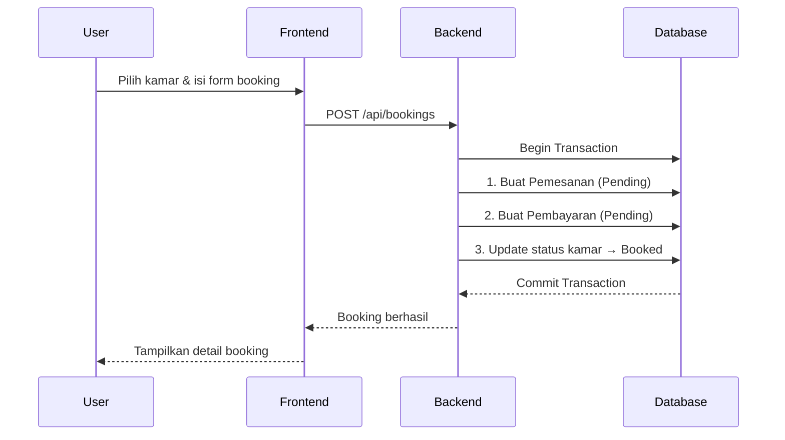
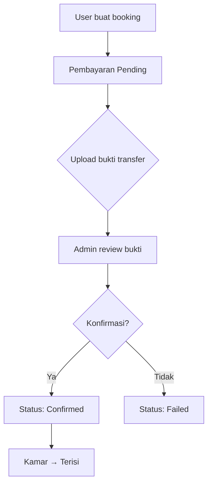
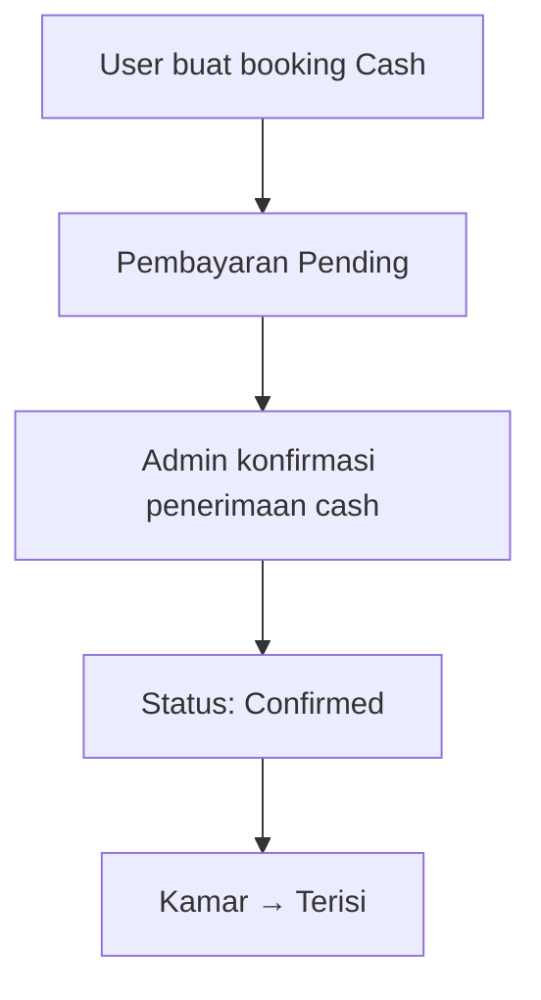

# Core Features

Detail implementasi fitur-fitur utama sistem, dilengkapi kode dari source yang sebenarnya.

## 1. Room Management

Kamar memiliki 4 status: **Tersedia**, **Terisi**, **Booked**, **Perbaikan**.

### Room Filtering (Frontend)

```typescript
// Dari fe/app/services/api.ts — Interface Room

export interface Room {
    id: number;
    nomor_kamar: string;
    tipe_kamar: string;
    fasilitas: string | string[];
    harga_per_bulan: number;
    status: 'Tersedia' | 'Terisi' | 'Perbaikan' | 'Booked';
    capacity: number;
    floor: number;
    size: string;
    bedrooms: number;
    bathrooms: number;
    description: string;
    image_url: string;
}
```

### Room API Calls

```typescript
// Dari fe/app/services/api.ts

export const api = {
    // Public - semua user
    getRooms: async () => apiCall<Room[]>('GET', '/kamar'),
    getRoomById: async (id: string) => apiCall<Room>('GET', `/kamar/${id}`),

    // Admin only
    createRoom: async (formData: FormData) => apiCall<Room>('POST', '/kamar', formData),
    updateRoom: async (id: string, formData: FormData) => apiCall<Room>('PUT', `/kamar/${id}`, formData),
    deleteRoom: async (id: string) => apiCall<MessageResponse>('DELETE', `/kamar/${id}`),
};
```

### Admin CRUD (Backend)

Admin bisa membuat, mengupdate, dan menghapus kamar. Upload gambar diproses via Cloudinary:

```go
// Flow di backend:
// 1. KamarHandler.CreateKamar → parse form + upload image ke Cloudinary
// 2. KamarService.CreateKamar → validasi business rules
// 3. KamarRepository → simpan ke database via GORM
```

## 2. Booking System

Proses booking menggunakan **Atomic Transaction** — jika salah satu langkah gagal, seluruh operasi di-rollback.

### Booking Flow



### Atomic Transaction (Backend)

```go
// Prinsip dari BookingService
err = s.db.Transaction(func(tx *gorm.DB) error {
    // 1. Buat record Pemesanan
    if err := tx.Create(&pemesanan).Error; err != nil {
        return err  // → ROLLBACK
    }

    // 2. Setup Pembayaran
    if err := tx.Create(&pembayaran).Error; err != nil {
        return err  // → ROLLBACK
    }

    // 3. Update status kamar ke "Booked"
    if err := tx.Model(&kamar).Update("status", "Booked").Error; err != nil {
        return err  // → ROLLBACK
    }

    return nil  // → COMMIT
})
```

### Booking API (Frontend)

```typescript
// Dari fe/app/services/api.ts

export const api = {
    getMyBookings: async () => apiCall<Booking[]>('GET', '/bookings'),
    createBooking: async (data: Partial<Booking>) => apiCall<Booking>('POST', '/bookings', data),
    createBookingWithProof: async (formData: FormData) => apiCall<Booking>('POST', '/bookings/with-proof', formData),
    cancelBooking: async (id: string) => apiCall<MessageResponse>('POST', `/bookings/${id}/cancel`),
    extendBooking: async (id: string, months: number) => apiCall<Payment>('POST', `/bookings/${id}/extend`, { months }),
};
```

### Auto-Cancel Expired Bookings

Booking yang tidak dibayar dalam waktu tertentu akan otomatis di-cancel oleh background worker:

```go
// Dari be/cmd/api/main.go — Background Workers

go func() {
    // Run initial check
    bookingService.AutoCancelExpiredBookings()

    // Check setiap 1 jam
    cancelTicker := time.NewTicker(1 * time.Hour)
    for range cancelTicker.C {
        bookingService.AutoCancelExpiredBookings()
    }
}()
```

## 3. Payment System

Mendukung 2 metode pembayaran: **Transfer Bank** dan **Cash**.

### Payment Flow: Transfer



### Payment Flow: Cash



### Payment API (Frontend)

```typescript
// Dari fe/app/services/api.ts

export const api = {
    createPayment: async (data: { pemesanan_id: number; payment_type: 'full' | 'dp' }) =>
        apiCall<{ message: string; payment: Payment }>('POST', '/payments', data),

    uploadPaymentProof: async (paymentId: number, file: File) => {
        const formData = new FormData();
        formData.append('proof', file);
        return apiCall<{ message: string; url: string }>('POST', `/payments/${paymentId}/proof`, formData);
    },

    // Admin only
    confirmPayment: async (paymentId: string) =>
        apiCall<MessageResponse>('PUT', `/payments/${paymentId}/confirm`),
};
```

### Payment Reminders

Sistem pengingat otomatis pembayaran bulanan:

```go
// Dari be/cmd/api/main.go
reminderService := service.NewReminderService(paymentRepo, db, emailSender, waSender)
schedulerService := scheduler.NewScheduler(reminderService)
schedulerService.Start()
```

Reminder dikirim via:
- **Email** (SMTP)
- **WhatsApp** (jika dikonfigurasi)

## 4. Gallery

Galeri foto properti yang dioptimasi oleh Cloudinary CDN.

```typescript
// Dari fe/app/services/api.ts

export interface Gallery {
    id: number;
    title: string;
    category: string;
    image_url: string;  // URL dari Cloudinary
}

export const api = {
    getGalleries: async () => apiCall<Gallery[]>('GET', '/galleries'),
    createGallery: async (formData: FormData) => apiCall<Gallery>('POST', '/galleries', formData),
    deleteGallery: async (id: string) => apiCall<MessageResponse>('DELETE', `/galleries/${id}`),
};
```

## 5. Review System

Penyewa yang terverifikasi dapat memberikan review (rating 1-5 + komentar).

```typescript
// Dari fe/app/services/api.ts

export interface Review {
    id: number;
    user_id: number;
    kamar_id: number;
    rating: number;     // 1.0 - 5.0
    comment: string;
    created_at?: string;
}

export const api = {
    getReviews: async (roomId: string) => apiCall<Review[]>('GET', `/kamar/${roomId}/reviews`),
    getAllReviews: async () => apiCall<Review[]>('GET', '/reviews'),
    createReview: async (review: Partial<Review>) => apiCall<Review>('POST', '/reviews', review),
};
```

## 6. Admin Dashboard

Dashboard analytics untuk admin dengan data real-time:

```typescript
// Dari fe/app/services/api.ts

export interface DashboardStats {
    total_revenue: number;
    active_tenants: number;
    available_rooms: number;
    occupied_rooms: number;
    pending_payments: number;
    pending_revenue: number;
    monthly_trend: { month: string; revenue: number }[];
    type_breakdown: { type: string; revenue: number; count: number }[];
    demographics: { name: string; value: number; color: string }[];
}
```

Dashboard menampilkan:
- **Revenue** — Total pendapatan dan tren bulanan
- **Occupancy** — Kamar tersedia vs terisi
- **Payments** — Pembayaran pending yang perlu dikonfirmasi
- **Demographics** — Statistik penyewa

### Admin Dashboard UX Enhancements

#### Page Transitions
Perpindahan antar tab admin (Dashboard, Kamar, Penyewa, dll.) menggunakan `AnimatePresence` dari `framer-motion`, menghasilkan transisi fade/slide yang halus dengan durasi 300ms.

#### Staggered Content Animations
Setiap halaman admin memiliki animasi entrance bertahap:
1. **Header** muncul pertama (delay 0ms)
2. **Filter / Stats Cards** muncul berikutnya (delay 100–200ms)
3. **Table / Charts / Grid** muncul terakhir (delay 200–400ms)

#### Dark/Light Mode Support
Semua komponen admin support dark mode penuh lewat kelas `dark:` Tailwind CSS. Mode tema disimpan di `localStorage` via `ThemeContext`.

#### Internationalization (i18n)
Seluruh teks di admin dashboard di-load dari file `messages/id.json` dan `messages/en.json` via `next-intl`, mendukung bahasa **Indonesia** dan **Inggris**.

#### PDF Export (Laporan)
Halaman `LuxuryReports.tsx` memiliki fitur export laporan ke **PDF** menggunakan `jspdf` + `jspdf-autotable` dengan:
- Header perusahaan (nama, alamat, tanggal)
- Executive summary (total revenue, pending revenue, occupancy)
- Tabel transaksi berwarna dengan status color-coded
- Footer dengan nomor halaman

---

> [!IMPORTANT]
> Semua upload gambar (kamar, galeri, profil, bukti transfer) diproses melalui **Cloudinary**. Gambar disimpan di cloud folder `koskosan/rooms`, bukan di server lokal.

