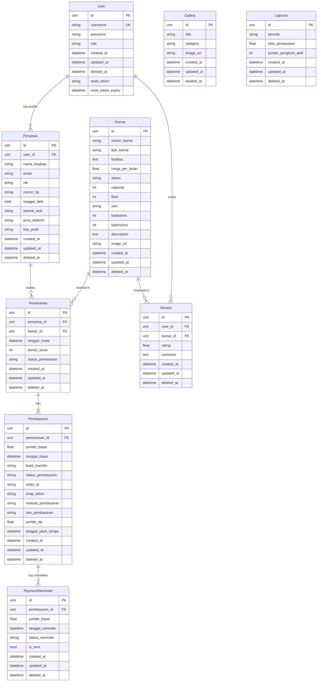

# 📊 Analisis Sistem Platform-Kos

> **Kost Putra Rahmat ZAW - Management System**  
> Dokumentasi lengkap untuk User Stories, Sitemap, dan Physical Data Model (PDM)

---

## 🎯 Ringkasan Sistem

**Platform-Kos** adalah sistem manajemen kos modern yang menggabungkan:
- **Backend**: Golang (Gin Framework) dengan PostgreSQL
- **Frontend**: Next.js 15 dengan TypeScript, SWR, dan Framer Motion
- **Payment Gateway**: Midtrans Integration (Snap API)
- **Authentication**: JWT + Google OAuth
- **Architecture**: Clean Architecture (Handler → Service → Repository)

### Fitur Utama
1. ✅ Manajemen Kamar (CRUD)
2. ✅ Sistem Booking dengan Payment Gateway
3. ✅ Dashboard Admin Real-time
4. ✅ Autentikasi Multi-channel (Email + Google)
5. ✅ Gallery Management
6. ✅ Review System
7. ✅ Payment Tracking & Reminders
8. ✅ Responsive UI dengan Dark Mode

---

## 👥 User Stories

### 🏠 **Role: Tenant (Penyewa)**

#### Epic 1: Authentication & Profile Management
- **US-T01**: Sebagai **calon penyewa**, saya ingin **mendaftar akun** menggunakan email atau Google OAuth agar dapat mengakses sistem booking
- **US-T02**: Sebagai **penyewa**, saya ingin **login** dengan username/password atau Google agar dapat mengakses dashboard saya
- **US-T03**: Sebagai **penyewa**, saya ingin **reset password** jika lupa agar dapat kembali mengakses akun
- **US-T04**: Sebagai **penyewa**, saya ingin **melihat dan mengedit profil** saya (nama lengkap, NIK, nomor HP, foto profil) agar data saya selalu update
- **US-T05**: Sebagai **penyewa**, saya ingin **mengubah password** agar keamanan akun terjaga

#### Epic 2: Room Browsing & Search
- **US-T06**: Sebagai **calon penyewa**, saya ingin **melihat daftar kamar** yang tersedia dengan filter (harga, tipe) agar dapat menemukan kamar sesuai budget
- **US-T07**: Sebagai **calon penyewa**, saya ingin **mencari kamar** berdasarkan nomor kamar atau kata kunci agar lebih cepat menemukan
- **US-T08**: Sebagai **calon penyewa**, saya ingin **melihat detail kamar** (fasilitas, harga, foto, ukuran, lantai) agar dapat mempertimbangkan pilihan
- **US-T09**: Sebagai **calon penyewa**, saya ingin **melihat review kamar** dari penghuni sebelumnya agar dapat menilai kualitas

#### Epic 3: Booking & Payment
- **US-T10**: Sebagai **penyewa**, saya ingin **membuat booking kamar** dengan memilih tanggal mulai dan durasi sewa agar dapat reservasi
- **US-T11**: Sebagai **penyewa**, saya ingin **memilih metode pembayaran** (Midtrans atau Cash) agar fleksibel dalam bayar
- **US-T12**: Sebagai **penyewa**, saya ingin **memilih tipe pembayaran** (Full atau DP) agar dapat menyesuaikan dengan kemampuan finansial
- **US-T13**: Sebagai **penyewa**, saya ingin **melakukan pembayaran via Midtrans** dengan berbagai metode (e-wallet, bank transfer, kartu kredit) agar mudah dan aman
- **US-T14**: Sebagai **penyewa**, saya ingin **upload bukti transfer** jika bayar cash agar admin dapat verifikasi
- **US-T15**: Sebagai **penyewa**, saya ingin **melihat status pembayaran** saya (Pending, Confirmed, Failed) agar tahu progres booking

#### Epic 4: My Bookings & History
- **US-T16**: Sebagai **penyewa**, saya ingin **melihat daftar booking** saya (aktif dan history) agar dapat tracking
- **US-T17**: Sebagai **penyewa**, saya ingin **melihat detail booking** (kamar, tanggal, durasi, status) agar dapat monitor
- **US-T18**: Sebagai **penyewa**, saya ingin **melihat statistik booking** saya (total pengeluaran, durasi menginap) dalam smart calendar
- **US-T19**: Sebagai **penyewa**, saya ingin **extend booking** (perpanjang sewa) jika ingin lanjut tinggal
- **US-T20**: Sebagai **penyewa**, saya ingin **cancel booking** jika ada perubahan rencana

#### Epic 5: Reviews & Feedback
- **US-T21**: Sebagai **penyewa**, saya ingin **memberikan review** untuk kamar yang saya tempati agar membantu calon penyewa lain
- **US-T22**: Sebagai **penyewa**, saya ingin **memberikan rating** (1-5 bintang) untuk kamar
- **US-T23**: Sebagai **calon penyewa**, saya ingin **melihat semua review** dari penghuni lain agar dapat pertimbangan

#### Epic 6: Contact & Support
- **US-T24**: Sebagai **calon penyewa**, saya ingin **menghubungi admin** via contact form agar dapat bertanya sebelum booking
- **US-T25**: Sebagai **penyewa**, saya ingin **melihat gallery** foto-foto kos agar dapat melihat kondisi real

---

### 👨‍💼 **Role: Admin**

#### Epic 7: Authentication & Dashboard
- **US-A01**: Sebagai **admin**, saya ingin **login** dengan kredensial admin agar dapat mengakses dashboard
- **US-A02**: Sebagai **admin**, saya ingin **melihat dashboard overview** (total revenue, active tenants, available rooms, pending payments) agar dapat monitor bisnis
- **US-A03**: Sebagai **admin**, saya ingin **melihat grafik revenue trend** bulanan agar dapat analisis performa
- **US-A04**: Sebagai **admin**, saya ingin **melihat occupancy rate** dalam bentuk chart agar dapat visualisasi hunian

#### Epic 8: Room Management
- **US-A05**: Sebagai **admin**, saya ingin **melihat daftar semua kamar** (tersedia, terisi, tidak tersedia) agar dapat kelola inventory
- **US-A06**: Sebagai **admin**, saya ingin **menambah kamar baru** dengan detail lengkap (nomor, tipe, fasilitas, harga, foto) agar dapat expand bisnis
- **US-A07**: Sebagai **admin**, saya ingin **mengedit data kamar** (harga, fasilitas, status) agar dapat update informasi
- **US-A08**: Sebagai **admin**, saya ingin **menghapus kamar** yang sudah tidak digunakan agar data tetap clean
- **US-A09**: Sebagai **admin**, saya ingin **upload foto kamar** agar tenant dapat melihat kondisi real

#### Epic 9: Tenant Management
- **US-A10**: Sebagai **admin**, saya ingin **melihat daftar semua penyewa** (aktif dan non-aktif) agar dapat monitor penghuni
- **US-A11**: Sebagai **admin**, saya ingin **melihat detail penyewa** (data pribadi, kamar yang ditempati, history booking) agar dapat tracking
- **US-A12**: Sebagai **admin**, saya ingin **melihat registrasi baru** agar dapat follow up

#### Epic 10: Payment Management
- **US-A13**: Sebagai **admin**, saya ingin **melihat semua pembayaran** (pending, confirmed, failed) agar dapat monitor cash flow
- **US-A14**: Sebagai **admin**, saya ingin **konfirmasi pembayaran cash** setelah verifikasi bukti transfer agar booking dapat diproses
- **US-A15**: Sebagai **admin**, saya ingin **melihat pending revenue** dari pembayaran yang belum dikonfirmasi agar dapat estimasi income
- **US-A16**: Sebagai **admin**, saya ingin **sistem otomatis update status kamar** setelah pembayaran sukses agar tidak perlu manual

#### Epic 11: Gallery Management
- **US-A17**: Sebagai **admin**, saya ingin **menambah foto ke gallery** dengan kategori agar tenant dapat lihat fasilitas
- **US-A18**: Sebagai **admin**, saya ingin **menghapus foto dari gallery** yang sudah tidak relevan

#### Epic 12: Reports & Analytics
- **US-A19**: Sebagai **admin**, saya ingin **melihat laporan keuangan** (total pemasukan, jumlah penghuni aktif) per periode agar dapat evaluasi
- **US-A20**: Sebagai **admin**, saya ingin **export laporan** untuk keperluan akuntansi

---

## 🗺️ Sitemap

### 🌐 **Public Pages** (Tidak perlu login)

```
📄 Homepage (/)
├── 🔍 Search & Filter Section
├── 🏠 Featured Rooms Grid
├── ⭐ Reviews Section
├── 📖 About Section
├── 📞 Contact Section
└── 🖼️ Gallery Preview

📄 Login Page (/login)
├── 👤 Tenant Login Form
├── 🔐 Admin Login Form
└── 🔗 Google OAuth Button

📄 Register Page (/register)
├── 📝 Registration Form
└── 🔗 Google OAuth Button

📄 Forgot Password (/forgot-password)
└── 📧 Email Input Form

📄 Reset Password (/reset-password)
└── 🔑 New Password Form

📄 Room Detail Page (/room/:id)
├── 🖼️ Room Images Gallery
├── 📋 Room Information
├── 💰 Pricing Details
├── ⭐ Reviews List
└── 🛒 Book Now Button (requires login)

📄 Gallery Page (/gallery)
└── 🖼️ All Photos Grid (categorized)
```

---

### 🔐 **Tenant Dashboard** (Requires Tenant Login)

```
📄 Tenant Platform (/tenant)
├── 🏠 Homepage Tab
│   ├── Search & Filter
│   ├── Room Cards
│   └── Quick Actions
│
├── 📖 My Bookings Tab
│   ├── 📊 Booking Statistics Card
│   ├── 📅 Smart Calendar
│   ├── 📋 Active Bookings List
│   ├── 🕒 Booking History
│   └── ⚡ Quick Actions (Extend, Cancel)
│
├── 👤 Profile Tab
│   ├── 📸 Profile Photo
│   ├── 📝 Personal Information
│   ├── ✏️ Edit Profile Form
│   └── 🔐 Change Password
│
├── 🖼️ Gallery Tab
│   └── Photo Grid by Category
│
└── 📞 Contact Us Tab
    └── Contact Form

📄 Room Detail Modal
├── 🖼️ Image Carousel
├── 📋 Full Details
├── ⭐ Reviews
└── 🛒 Booking Flow

📄 Booking Flow Modal
├── Step 1: Room Selection
├── Step 2: Date & Duration
├── Step 3: Payment Method (Midtrans/Cash)
├── Step 4: Payment Type (Full/DP)
└── Step 5: Payment Confirmation
```

---

### 👨‍💼 **Admin Dashboard** (Requires Admin Login)

```
📄 Admin Dashboard (/admin)
├── 📊 Dashboard Overview
│   ├── 💰 Total Revenue Card
│   ├── 👥 Active Tenants Card
│   ├── 🏠 Available Rooms Card
│   ├── 💳 Pending Payments Card
│   ├── 📈 Revenue Trend Chart
│   ├── 🥧 Occupancy Donut Chart
│   ├── 📋 Recent Registrations
│   └── 📊 Performance Metrics
│
├── 🏠 Room Management
│   ├── 📋 Rooms Table (with filters)
│   ├── ➕ Add New Room Form
│   ├── ✏️ Edit Room Modal
│   ├── 🗑️ Delete Room Action
│   └── 📸 Upload Room Image
│
├── 👥 Tenant Data
│   ├── 📋 Tenants Table
│   ├── 🔍 Search & Filter
│   └── 👁️ View Tenant Details
│
├── 💳 Payment Confirmation
│   ├── 📋 Payments Table (All/Pending/Confirmed)
│   ├── ✅ Confirm Cash Payment
│   ├── 👁️ View Payment Details
│   └── 📄 View Bukti Transfer
│
├── 🖼️ Gallery Management
│   ├── 📋 Gallery Grid
│   ├── ➕ Upload New Photo
│   └── 🗑️ Delete Photo
│
└── 📊 Financial Reports
    ├── 📈 Revenue Charts
    ├── 📋 Monthly Reports
    ├── 📊 Occupancy Analytics
    └── 📥 Export Reports
```

---

## 🗄️ Physical Data Model (PDM)

### Database Schema Diagram



---

### 📋 Tabel Detail

#### 1. **User** (Autentikasi)
| Column | Type | Constraint | Description |
|--------|------|------------|-------------|
| id | UINT | PK, AUTO_INCREMENT | ID unik user |
| username | VARCHAR(255) | UNIQUE, NOT NULL | Username untuk login |
| password | VARCHAR(255) | NOT NULL | Password (hashed dengan Argon2) |
| role | VARCHAR(50) | NOT NULL | Role: 'admin' atau 'penyewa' |
| created_at | TIMESTAMP | | Waktu pembuatan akun |
| updated_at | TIMESTAMP | | Waktu update terakhir |
| deleted_at | TIMESTAMP | NULLABLE | Soft delete |
| reset_token | VARCHAR(255) | NULLABLE | Token untuk reset password |
| reset_token_expiry | TIMESTAMP | NULLABLE | Expiry token reset |

**Indexes:**
- PRIMARY KEY: `id`
- UNIQUE INDEX: `username`
- INDEX: `deleted_at`

---

#### 2. **Penyewa** (Profil Tenant)
| Column | Type | Constraint | Description |
|--------|------|------------|-------------|
| id | UINT | PK, AUTO_INCREMENT | ID unik penyewa |
| user_id | UINT | FK → User.id | Relasi ke tabel User |
| nama_lengkap | VARCHAR(255) | NOT NULL | Nama lengkap penyewa |
| email | VARCHAR(255) | NOT NULL | Email penyewa |
| nik | VARCHAR(16) | | NIK KTP |
| nomor_hp | VARCHAR(20) | | Nomor HP/WhatsApp |
| tanggal_lahir | DATE | | Tanggal lahir |
| alamat_asal | TEXT | | Alamat asal |
| jenis_kelamin | VARCHAR(10) | | 'Laki-laki' atau 'Perempuan' |
| foto_profil | VARCHAR(255) | | URL foto profil |
| created_at | TIMESTAMP | | |
| updated_at | TIMESTAMP | | |
| deleted_at | TIMESTAMP | NULLABLE | Soft delete |

**Indexes:**
- PRIMARY KEY: `id`
- FOREIGN KEY: `user_id` → `User.id`
- INDEX: `deleted_at`

---

#### 3. **Kamar** (Room Data)
| Column | Type | Constraint | Description |
|--------|------|------------|-------------|
| id | UINT | PK, AUTO_INCREMENT | ID unik kamar |
| nomor_kamar | VARCHAR(50) | NOT NULL | Nomor/nama kamar (e.g., "A1", "B2") |
| tipe_kamar | VARCHAR(100) | NOT NULL | Tipe: 'Standard', 'Premium', 'Deluxe' |
| fasilitas | TEXT | | Daftar fasilitas (comma-separated) |
| harga_per_bulan | DECIMAL(10,2) | NOT NULL | Harga sewa per bulan |
| status | VARCHAR(50) | NOT NULL | 'Tersedia', 'Terisi', 'Tidak Tersedia' |
| capacity | INT | | Kapasitas orang |
| floor | INT | | Lantai |
| size | VARCHAR(50) | | Ukuran kamar (e.g., "3x4m") |
| bedrooms | INT | | Jumlah kamar tidur |
| bathrooms | INT | | Jumlah kamar mandi |
| description | TEXT | | Deskripsi kamar |
| image_url | VARCHAR(255) | | URL foto kamar utama |
| created_at | TIMESTAMP | | |
| updated_at | TIMESTAMP | | |
| deleted_at | TIMESTAMP | NULLABLE | Soft delete |

**Indexes:**
- PRIMARY KEY: `id`
- INDEX: `status` (untuk filter cepat)
- INDEX: `tipe_kamar` (untuk filter tipe)
- INDEX: `deleted_at`

---

#### 4. **Pemesanan** (Booking)
| Column | Type | Constraint | Description |
|--------|------|------------|-------------|
| id | UINT | PK, AUTO_INCREMENT | ID unik booking |
| penyewa_id | UINT | FK → Penyewa.id | ID penyewa yang booking |
| kamar_id | UINT | FK → Kamar.id | ID kamar yang dibooking |
| tanggal_mulai | DATE | NOT NULL | Tanggal mulai sewa |
| durasi_sewa | INT | NOT NULL | Durasi sewa (dalam bulan) |
| status_pemesanan | VARCHAR(50) | NOT NULL | 'Pending', 'Confirmed', 'Active', 'Completed', 'Cancelled' |
| created_at | TIMESTAMP | | |
| updated_at | TIMESTAMP | | |
| deleted_at | TIMESTAMP | NULLABLE | Soft delete |

**Indexes:**
- PRIMARY KEY: `id`
- FOREIGN KEY: `penyewa_id` → `Penyewa.id`
- FOREIGN KEY: `kamar_id` → `Kamar.id`
- INDEX: `status_pemesanan`
- INDEX: `deleted_at`

**Business Rules:**
- Satu penyewa hanya bisa booking 1 kamar aktif dalam satu waktu
- Status kamar otomatis berubah menjadi "Terisi" setelah pembayaran confirmed

---

#### 5. **Pembayaran** (Payment)
| Column | Type | Constraint | Description |
|--------|------|------------|-------------|
| id | UINT | PK, AUTO_INCREMENT | ID unik pembayaran |
| pemesanan_id | UINT | FK → Pemesanan.id | ID booking terkait |
| jumlah_bayar | DECIMAL(10,2) | NOT NULL | Jumlah yang dibayar |
| tanggal_bayar | TIMESTAMP | | Waktu pembayaran |
| bukti_transfer | VARCHAR(255) | | URL bukti transfer (untuk cash) |
| status_pembayaran | VARCHAR(50) | NOT NULL | 'Pending', 'Confirmed', 'Failed', 'Settled' |
| order_id | VARCHAR(255) | UNIQUE | Order ID dari Midtrans |
| snap_token | VARCHAR(255) | | Snap token dari Midtrans |
| metode_pembayaran | VARCHAR(50) | NOT NULL | 'midtrans' atau 'cash' |
| tipe_pembayaran | VARCHAR(50) | NOT NULL | 'full' atau 'dp' (down payment) |
| jumlah_dp | DECIMAL(10,2) | | Jumlah DP jika tipe = 'dp' |
| tanggal_jatuh_tempo | DATE | | Tanggal jatuh tempo cicilan berikutnya |
| created_at | TIMESTAMP | | |
| updated_at | TIMESTAMP | | |
| deleted_at | TIMESTAMP | NULLABLE | Soft delete |

**Indexes:**
- PRIMARY KEY: `id`
- FOREIGN KEY: `pemesanan_id` → `Pemesanan.id`
- UNIQUE INDEX: `order_id`
- INDEX: `status_pembayaran`
- INDEX: `deleted_at`

---

#### 6. **PaymentReminder** (Reminder Pembayaran Bulanan)
| Column | Type | Constraint | Description |
|--------|------|------------|-------------|
| id | UINT | PK, AUTO_INCREMENT | ID unik reminder |
| pembayaran_id | UINT | FK → Pembayaran.id | ID pembayaran terkait |
| jumlah_bayar | DECIMAL(10,2) | NOT NULL | Jumlah yang harus dibayar |
| tanggal_reminder | DATE | NOT NULL | Tanggal reminder |
| status_reminder | VARCHAR(50) | NOT NULL | 'Pending', 'Paid', 'Expired' |
| is_sent | BOOLEAN | DEFAULT FALSE | Apakah reminder sudah dikirim |
| created_at | TIMESTAMP | | |
| updated_at | TIMESTAMP | | |
| deleted_at | TIMESTAMP | NULLABLE | Soft delete |

**Indexes:**
- PRIMARY KEY: `id`
- FOREIGN KEY: `pembayaran_id` → `Pembayaran.id`
- INDEX: `tanggal_reminder`
- INDEX: `status_reminder`
- INDEX: `deleted_at`

---

#### 7. **Review** (Ulasan Kamar)
| Column | Type | Constraint | Description |
|--------|------|------------|-------------|
| id | UINT | PK, AUTO_INCREMENT | ID unik review |
| user_id | UINT | FK → User.id | ID user yang menulis review |
| kamar_id | UINT | FK → Kamar.id | ID kamar yang direview |
| rating | DECIMAL(2,1) | NOT NULL | Rating 1.0 - 5.0 |
| comment | TEXT | | Komentar review |
| created_at | TIMESTAMP | | |
| updated_at | TIMESTAMP | | |
| deleted_at | TIMESTAMP | NULLABLE | Soft delete |

**Indexes:**
- PRIMARY KEY: `id`
- FOREIGN KEY: `user_id` → `User.id`
- FOREIGN KEY: `kamar_id` → `Kamar.id`
- INDEX: `rating`
- INDEX: `deleted_at`

---

#### 8. **Gallery** (Galeri Foto)
| Column | Type | Constraint | Description |
|--------|------|------------|-------------|
| id | UINT | PK, AUTO_INCREMENT | ID unik foto |
| title | VARCHAR(255) | NOT NULL | Judul foto |
| category | VARCHAR(100) | | Kategori: 'Room', 'Facility', 'Common Area' |
| image_url | VARCHAR(255) | NOT NULL | URL foto |
| created_at | TIMESTAMP | | |
| updated_at | TIMESTAMP | | |
| deleted_at | TIMESTAMP | NULLABLE | Soft delete |

**Indexes:**
- PRIMARY KEY: `id`
- INDEX: `category`
- INDEX: `deleted_at`

---

#### 9. **Laporan** (Financial Reports)
| Column | Type | Constraint | Description |
|--------|------|------------|-------------|
| id | UINT | PK, AUTO_INCREMENT | ID unik laporan |
| periode | VARCHAR(50) | NOT NULL | Periode laporan (e.g., "2024-01") |
| total_pemasukan | DECIMAL(12,2) | NOT NULL | Total revenue periode tersebut |
| jumlah_penghuni_aktif | INT | NOT NULL | Jumlah penghuni aktif |
| created_at | TIMESTAMP | | |
| updated_at | TIMESTAMP | | |
| deleted_at | TIMESTAMP | NULLABLE | Soft delete |

**Indexes:**
- PRIMARY KEY: `id`
- INDEX: `periode`
- INDEX: `deleted_at`

---

## 🔗 Relasi Antar Tabel

### One-to-Many Relationships
1. **User → Penyewa** (1:1)
   - Satu user memiliki satu profil penyewa
   
2. **Penyewa → Pemesanan** (1:N)
   - Satu penyewa bisa memiliki banyak booking (history)
   
3. **Kamar → Pemesanan** (1:N)
   - Satu kamar bisa dibooking berkali-kali (berbeda waktu)
   
4. **Pemesanan → Pembayaran** (1:N)
   - Satu booking bisa memiliki banyak pembayaran (DP + cicilan)
   
5. **Pembayaran → PaymentReminder** (1:N)
   - Satu pembayaran bisa memiliki banyak reminder
   
6. **User → Review** (1:N)
   - Satu user bisa menulis banyak review
   
7. **Kamar → Review** (1:N)
   - Satu kamar bisa memiliki banyak review

---

## 🔐 API Endpoints Summary

### Public Endpoints
- `POST /api/auth/login` - Login
- `POST /api/auth/register` - Register
- `POST /api/auth/google-login` - Google OAuth
- `POST /api/auth/forgot-password` - Forgot Password
- `POST /api/auth/reset-password` - Reset Password
- `GET /api/kamar` - Get all rooms
- `GET /api/kamar/:id` - Get room detail
- `GET /api/kamar/:id/reviews` - Get room reviews
- `GET /api/galleries` - Get all gallery photos
- `GET /api/reviews` - Get all reviews
- `POST /api/contact` - Submit contact form
- `POST /api/payments/webhook` - Midtrans webhook

### Protected Endpoints (Tenant)
- `GET /api/profile` - Get user profile
- `PUT /api/profile` - Update profile
- `PUT /api/profile/change-password` - Change password
- `GET /api/bookings` - Get my bookings
- `POST /api/bookings` - Create booking
- `POST /api/payments/snap-token` - Create Midtrans payment
- `POST /api/payments/confirm-cash/:id` - Confirm cash payment
- `POST /api/reviews` - Create review

### Admin Endpoints
- `GET /api/dashboard` - Get dashboard stats
- `POST /api/kamar` - Create room
- `PUT /api/kamar/:id` - Update room
- `DELETE /api/kamar/:id` - Delete room
- `POST /api/galleries` - Upload gallery photo
- `DELETE /api/galleries/:id` - Delete gallery photo
- `GET /api/payments` - Get all payments
- `PUT /api/payments/:id/confirm` - Confirm payment
- `GET /api/tenants` - Get all tenants

---

## 📊 Business Logic Highlights

### 1. **Booking Flow**
```
1. Tenant pilih kamar → Create Pemesanan (status: Pending)
2. Pilih metode pembayaran (Midtrans/Cash) & tipe (Full/DP)
3. Jika Midtrans → Generate Snap Token → Redirect ke Midtrans
4. Jika Cash → Upload bukti transfer → Admin confirm
5. Setelah payment confirmed → Status Pemesanan: Confirmed
6. Status Kamar otomatis berubah: Terisi
```

### 2. **Payment Reminder System**
```
- Sistem otomatis create PaymentReminder untuk pembayaran bulanan
- Reminder dikirim H-3 sebelum jatuh tempo
- Jika sudah bayar → Status: Paid
- Jika lewat jatuh tempo → Status: Expired
```

### 3. **Room Status Management**
```
- Tersedia: Bisa dibooking
- Terisi: Sudah ada booking aktif
- Tidak Tersedia: Maintenance/renovasi
```

### 4. **One Room Per Tenant Rule**
```
- Sistem check: Apakah tenant sudah punya booking aktif?
- Jika ya → Block booking baru
- Jika tidak → Allow booking
```

---

## 🎨 Frontend Tech Stack

- **Framework**: Next.js 15 (App Router)
- **Language**: TypeScript
- **Styling**: Tailwind CSS + Custom CSS
- **State Management**: SWR (Stale-While-Revalidate)
- **Animations**: Framer Motion
- **UI Components**: Shadcn/ui + Custom Components
- **Charts**: Recharts
- **Icons**: Lucide React
- **Image Handling**: Next/Image with Fallback

---

## 🛠️ Backend Tech Stack

- **Language**: Go 1.24
- **Framework**: Gin Gonic
- **ORM**: GORM
- **Database**: PostgreSQL
- **Authentication**: JWT + Argon2
- **Payment**: Midtrans Snap API
- **Email**: SMTP (for password reset)
- **File Upload**: Local storage (`/uploads`)
- **Architecture**: Clean Architecture (Handler → Service → Repository)

---

## 📝 Notes

- Sistem menggunakan **soft delete** untuk semua tabel (deleted_at)
- **SWR** digunakan untuk caching dan auto-refresh data
- **Dark mode** support di seluruh aplikasi
- **Responsive design** untuk mobile, tablet, dan desktop
- **Real-time dashboard** dengan auto-refresh setiap 30 detik
- **Midtrans Sandbox** untuk testing payment
- **Google OAuth** untuk kemudahan login

---

> **Dokumentasi ini dibuat berdasarkan analisis lengkap dari:**
> - Database models (`be/internal/models/models.go`)
> - API routes (`be/internal/routes/routes.go`)
> - Frontend components (`fe/app/components/`)
> - Service layer logic (`be/internal/service/`)
